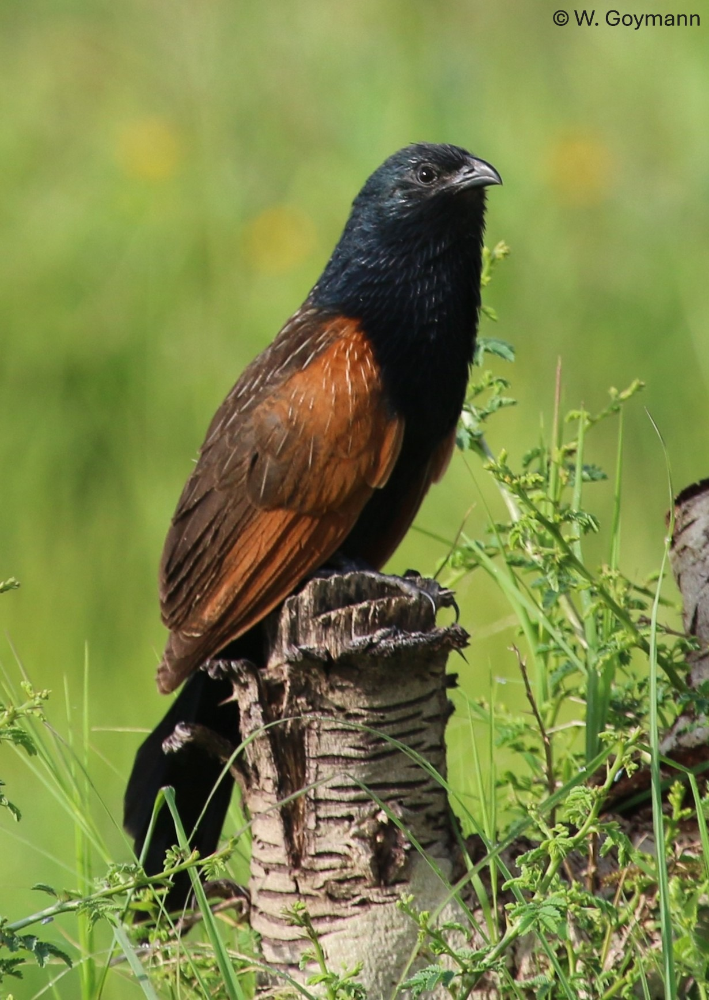
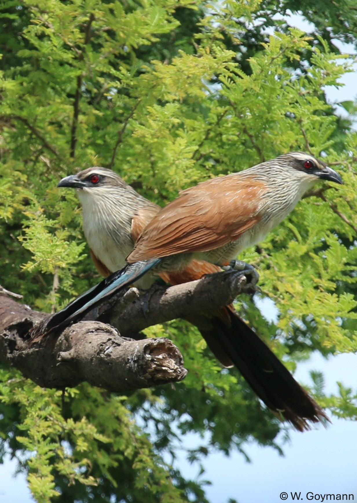

# Reproducible datasets and code for:

## Sex-role-reversal and the Bateman gradient in coucals – females benefit from mating with multiple partners

### Guadalupe Lopez-Nava12, Ignas Safari3, Clemens Küpper4, Wolfgang Goymann125\*
\* corresponding author

1)  *Max Planck Institute for Biological Intelligence (MPI-BI), Department Behavioural Neurobiology, Eberhard-Gwinner-Str., 82319 Seewiesen, Germany*
2)  *Ludwig Maximilians University Munich, Department Biology II, Großhaderner Str. 2, 82152 Martinsried, Germany *
3)  *Department of Biology, College of Natural and Mathematical Sciences, University of Dodoma, P.O. Box 338, Dodoma, Tanzania *
4)  *Max Planck Institute for Biological Intelligence (MPI-BI), Behavioural Genetics and Evolutionary Ecology, Eberhard-Gwinner-Str., 82319 Seewiesen, Germany*
5)  *Coucal Project, P.O. Box 26, Chimala, Tanzania*

✉ For correspondence regarding the code, statistical analyses,please
contact: Guadalupe (<a href= "mailto:lopez-nava.guadalupe@bi.mpg.de">lopez-nava.guadalupe[at]bi.mpg.de</a>)

✉ For correspondence regarding the data collection and study system please
contact: 
Wolfgang (<a href= "mailto:wgoymann@bi.mpg.de">w.goymann[at]bi.mpg.de</a>)

In this repository you can find all the data and code needed to
reproduce our study on Bateman Gradients in Black coucals (*Centropus grillii*) and White-browed coucals (*Centropus superciliosus*) inhabiting the Usangu wetlands of Tanzania.
Our study is based on data collected over **13 breeding** seasons for White-browed coucals and **15 breeding seasons** for Black coucals). 

| Black Coucal | White-browed Coucal |
|--------------|-------------------|
| {width=300} | {width=300} |

#### Repository Contents

- [`BatemangradientsCoucals.Rproj`](https://github.com/lguadal/ContaminantsMitoShearwaters/blob/main/ContaminantsMitoShearwater.Rproj)
    RStudio project to run and reproduce results

## Black coucals 
- [`GradientsBC.Rmd`](https://github.com/lguadal/Batemangradients_coucals/blob/main/GradientsBC.Rmd)
    R Markdown script containing statistical analyses of Bateman gradients and differences between slopes, Opportunity for Selection estimates and Path Selection analyses for age. All analyses are referenced according to their number in the manuscript
- [`PathsSelection_BC.Rmd`](https://github.com/lguadal/Batemangradients_coucals/blob/main/PathsSelection_BC.Rmd)
    R Markdown containing statistical analyses of path selection analyses of morphological traits. All analyses are referenced according to their number in the manuscript

## White-browed coucals
- [`GradientsWB.Rmd`](https://github.com/lguadal/Batemangradients_coucals/blob/main/GradientsWB.Rmd)
    R Markdown script containing statistical analyses of Bateman gradients and differences between slopes, Opportunity for Selection estimates and Path Selection analyses for age. All analyses are referenced according to their number in the manuscript
- [`PathsSelection_BC.Rmd`](https://github.com/lguadal/Batemangradients_coucals/blob/main/PathsSelection_WB.Rmd)
    R Markdown containing statistical analyses of path selection analyses of morphological traits. All analyses are referenced according to their number in the manuscript

[**`figures`**](https://github.com/lguadal/Batemangradients_coucals/tree/main/figures) all of which were created using the R package [ggplot2 v.3.3.3](https://cran.r-project.org/web/packages/ggplot2/index.html).

-   [`/black coucals/ Fig1`](https://github.com/lguadal/Batemangradients_coucals/blob/main/figures/black%20coucals/Fig1_gradients_BC.png) 
-   [`/whitebrowed coucals/Fig2`](https://github.com/lguadal/Batemangradients_coucals/blob/main/figures/whitebrowed%20coucals/Fig2_gradients_WC.png) 
-   [`Fig3`](https://github.com/lguadal/Batemangradients_coucals/tree/main/figures/fig3) All figures associated to the panel saved individually.

[**`images`**](https://github.com/lguadal/Batemangradients_coucals/tree/main/images) folder containing the graphic in the Readme file
-   [`WBcoucals.jpeg`](https://github.com/lguadal/Batemangradients_coucals/blob/main/images/WBcoucals.jpeg) 
-   [`Blackcoucal.jpeg`](https://github.com/lguadal/Batemangradients_coucals/blob/main/images/Blackcoucal.jpeg)

[**`supl`**](https://github.com/lguadal/Batemangradients_coucals/tree/main/supl) folder including figures and tables of supplementary information: tables created using the R package [gt v.0.2.2](https://cran.r-project.org/web/packages/gt/index.html) and figures using  R package [ggplot2 v.3.3.3](https://cran.r-project.org/web/packages/ggplot2/index.html).

-   [`FigS1.pdf`](https://github.com/lguadal/Batemangradients_coucals/blob/main/supl/FigS1.png) 
-   [`TabS1a.pdf`](https://github.com/lguadal/Batemangradients_coucals/blob/main/supl/TableS1a_BC.pdf)
-   [`TabS1b_females.pdf`](https://github.com/lguadal/Batemangradients_coucals/blob/main/supl/TableS1b_females_BC.pdf) 
-   [`TabS1b_males.pdf`](https://github.com/lguadal/Batemangradients_coucals/blob/main/supl/TableS1b_males_BC.pdf)
-   [`TabS2a.pdf`](https://github.com/lguadal/Batemangradients_coucals/blob/main/supl/TableS2a_WBC.pdf)
-   [`TabS2b.pdf`](https://github.com/lguadal/Batemangradients_coucals/blob/main/supl/TableS2b_WBC.pdf)

[**`tables`**](https://github.com/lguadal/Batemangradients_coucals/tree/main/tables) tables from Results section (referenced by table number in manuscript), all of which were created using the R package [gt v.0.2.2](https://cran.r-project.org/web/packages/gt/index.html).
-   [`Table1_BC_I.pdf`](https://github.com/lguadal/Batemangradients_coucals/blob/main/tables/Table1_BC_OppSel.pdf) Estimates Opportunity for Selection in Black coucals.
-   [`Table1_BC_Is.pdf`](https://github.com/lguadal/Batemangradients_coucals/blob/main/tables/Table1_BC_OppSexSel.pdf) Estimates Opportunity for Sexual Selection in Black coucals.
-   [`Table1_WB_I.pdf`](https://github.com/lguadal/Batemangradients_coucals/blob/main/tables/Table1_WB_OppSel.pdf) Estimates Opportunity for Selection in White-browed coucals.
-   [`Table1_WB_Is.pdf`](https://github.com/lguadal/Batemangradients_coucals/blob/main/tables/Table1_WB_OppSexSel.pdf) Estimates Opportunity for Sexual Selection in White-browed coucals.

-   [`TabS2b.pdf`](https://github.com/lguadal/Batemangradients_coucals/blob/main/supl/TableS2b_WBC.pdf)

[**`data`**](https://github.com/lguadal/ContaminantsMitoShearwaters/tree/main/data)

-   [`data_MitoCont_Shearwaters.csv`](https://github.com/lguadal/ContaminantsMitoShearwaters/blob/main/data/data_MitoCont_Shearwaters.csv)
-   [`data_MitoCont_Shearwaters.rds`](https://github.com/lguadal/ContaminantsMitoShearwaters/blob/main/data/data_MitoCont_Shearwaters.rds)

## Dataset description: 

This dataset contains physiological and contaminant measurements from Scopoli's shearwaters sampled in 2020–2021.  
Each row represents an individual bird and includes information on biological attributes (age, body mass, sex), mitochondrial function (bioenergetic assays), contaminant concentrations (PFAS and mercury), and stable isotope ratios (δ¹³C, δ¹⁵N).

---

### Column descriptions

| Column name | Type | Units / Scale | Description |
|--------------|------|---------------|--------------|
| `year` | factor | categorical (2020, 2021) | Sampling year. |
| `nest` | factor | categorical (31 levels) | Nest identifier corresponding to nest site. |
| `ring` | factor | categorical (48 levels) | Ring number identifying each individual bird. Real ring numbers have been replaced with anonymized (dummy) identifiers, but the "real" ring numbers can be provided upon request. |
| `sex` | factor | categorical (`Female`, `Male`) | Sex of the individual. |
| `age` | numeric | years | Estimated age of the individual. |
| `bodymass` | integer | g | Body mass in grams at the time of sampling. |
| `DateMito` | factor | date (MM/DD/YYYY) | Date when mitochondrial measurements were performed. |
| `TimeMito` | factor | time (hh:mm:ss) | Time of day when mitochondrial assays were conducted. |
| `CMR` | numeric | pmol O₂ s⁻¹ mg⁻¹ | Cellular metabolic rate. |
| `OXPHOS` | numeric | pmol O₂ s⁻¹ mg⁻¹ | Oxidative phosphorylation. |
| `LEAK` | numeric | pmol O₂ s⁻¹ mg⁻¹ | Proton leak respiration rate (non-phosphorylating). |
| `ETS` | numeric | pmol O₂ s⁻¹ mg⁻¹ | Maximal electron transport system capacity. |
| `FCR1` | numeric | ratio | Coupling inefficiency index: proportion of LEAK to CMR respiration. |
| `PFOA` | numeric | ng/g | Perfluorooctanoic acid (PFOA) concentration. |
| `PFHPS` | numeric | ng/g | Perfluoroheptanesulfonic acid (PFHpS) concentration. |
| `PFNA` | numeric | ng/g | Perfluorononanoic acid (PFNA) concentration. |
| `P37DMOA` | numeric | ng/g | Perfluoro-3,7-dimethyloctanoic acid (P37DMOA) concentration. |
| `PFOS` | numeric | ng/g | Perfluorooctanosulfonic acid (PFOS) concentration. |
| `PFDA` | numeric | ng/g | Perfluorodecanoic acid (PFDA) concentration. |
| `PFUNA` | numeric | ng/g | Perfluoroundecanoic acid (PFUnA) concentration. |
| `PFDODA` | numeric | ng/g | Perfluorododecanoic acid (PFDoDA) concentration. |
| `FTS_10_2` | numeric | ng/g | 0:2 Fluorotelomer sulfonic (FTS_10_2) acid concentration. |
| `PFTRIDA` | numeric | ng/g | Perfluorotridecanoic acid (PFTrDA) concentration. |
| `PFTDA` | numeric | ng/g | Perfluorotetradecanoic acid (PFTDA) concentration. |
| `PFHXS` | numeric | ng/g | Perfluorohexane sulfonic acid (PFHxS) concentration. |
| `PFDS` | numeric | ng/g | Perfluorodecane sulfonic acid (PFDS) concentration. |
| `PFOSA` | numeric | ng/g | Perfluorooctane sulfonamide (PFOSA) concentration. |
| `SUMPFAS` | numeric | ng/g | Sum of all measured PFAS concentrations for each individual. |
| `d13C` | numeric | ‰ (per mil, δ notation) | Stable carbon isotope ratio; indicates dietary carbon sources. |
| `X.C` | numeric | % | Percent carbon content of the tissue. |
| `d15N` | numeric | ‰ (per mil, δ notation) | Stable nitrogen isotope ratio; indicates trophic position. |
| `X.N` | numeric | % | Percent nitrogen content of the tissue. |
| `C_N` | numeric | ratio | Carbon-to-nitrogen ratio of the sample (proxy for lipid content). |
| `hg` | numeric | µg/g dry weight | Total mercury concentration in tissue. |
| `Notes` | factor | text | Additional comments. |
| `d15N.Z` | numeric | standardized (Z-score) | Standardized δ¹⁵N value (centered and scaled). |
| `d13C.Z` | numeric | standardized (Z-score) | Standardized δ¹³C value. |
| `age.Z` | numeric | standardized (Z-score) | Standardized age of the individual. |
| `bodymass.Z` | numeric | standardized (Z-score) | Standardized body mass. |
| `hg.Z` | numeric | standardized (Z-score) | Standardized mercury concentration. |
| `SUMPFAS.Z` | numeric | standardized (Z-score) | Standardized total PFAS concentration. |

---

### Notes

- **Units:** Concentrations for PFAS are expressed in ng/g, and mercury in µg/g.
- **Stable isotopes:** δ¹³C and δ¹⁵N values are expressed relative to international standards (VPDB for carbon; Air N₂ for nitrogen).  
- **Z-scores:** Variables ending in `.Z` are standardized (mean = 0, SD = 1) to facilitate multivariate analysis.  
- **Mitochondrial bioenergetic (CMR, OXPHOS, LEAK, ETS, FCR1)** All traits (except FCR1, which is a ratio) are
expressed in pmol O₂ s⁻¹ mg⁻¹ and derived from high-resolution respirometry measurements on red blood cells samples.

---

#### Usage Policy

You are welcome to view and download the materials in this repository.  
However:

- **Do not** use, modify, or share any code or data without **written permission** by Stefania Casagrande (<a href= "mailto:stefania.casagrande@bi.mpg.de">stefania.casagrande[at]bi.mpg.de</a>) 

© 2025 Guadalupe Lopez-Nava – All rights reserved.
